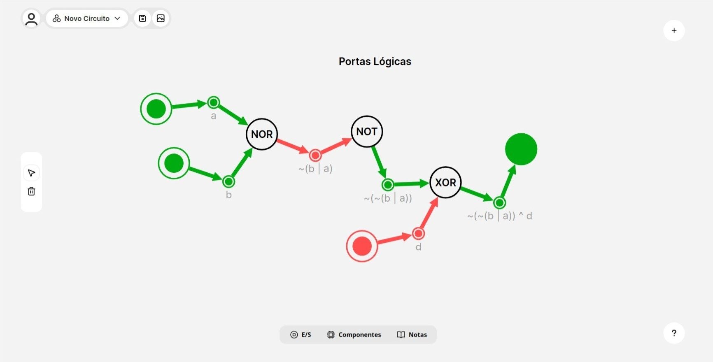
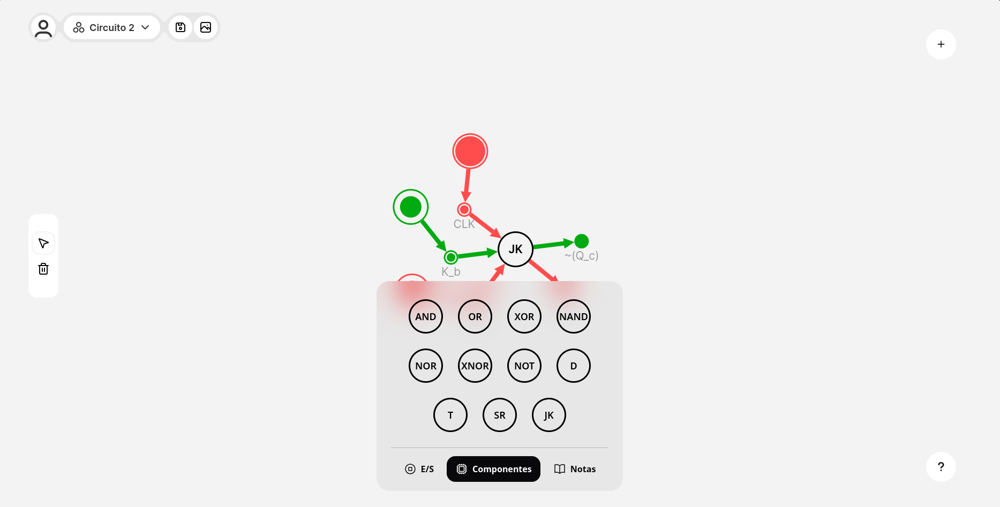
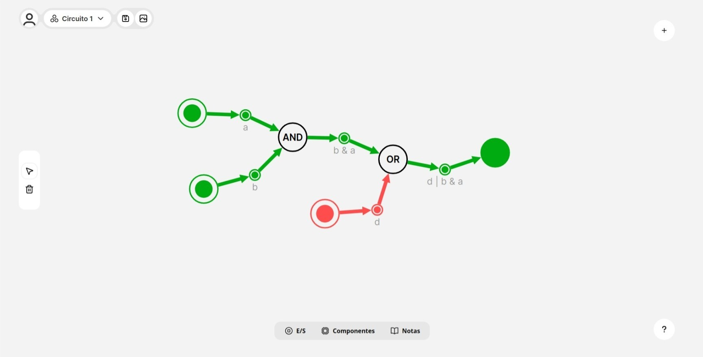
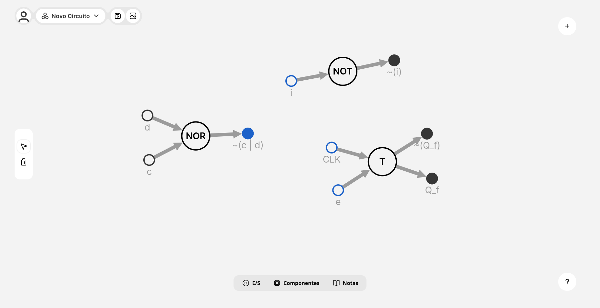

# Circulogi

> A web application for simulating combinational and sequential digital circuits based on directed graphs.



Circulogi is an open-source web simulator built with **Nuxt.js** that represents digital circuits as **directed graphs** instead of traditional schematics. This approach provides a more abstract and readable representation, making it easier for students and educators to understand, analyze, and debug digital logic circuits.

---

## ✨ Features

- **Directed graph visualization** — Logic gates and connections are rendered as an interactive directed graph, showing boolean sub-expressions directly on each node's output
- **Combinational circuits** — Supports AND, OR, NOT, XOR, NAND, NOR, and XNOR gates
- **Sequential circuits** — Supports D, T, SR, and JK flip-flops with clock components
- **Real-time simulation** — Signal propagation is computed on every user interaction using a BFS (Breadth-First Search) algorithm
- **Boolean expression labels** — Each gate output automatically displays its boolean sub-expression (e.g. `~(b | a)`, `~(~(b | a)) ^ d`)
- **Cloud save & shareable links** — Circuits are automatically saved and can be shared via a public URL
- **Component menu** — Add inputs, outputs, logic gates, flip-flops, clocks, and text notes from a bottom toolbar
- **Export as image** — Download a snapshot of the current circuit

---

## 📸 Screenshots

### Logic Gates — Signal Propagation


### Circuit with AND + OR Gates


### Component Menu


### Combinational & Sequential Components


---

## 🚀 Getting Started

### Prerequisites

- Node.js ≥ 18
- PostgreSQL database (or a Supabase project)

### Installation

```bash
# Clone the repository
git clone https://github.com/pedrobealves/circulogi.git
cd circulogi

# Install dependencies
npm install

# Configure environment variables
cp .env.example .env
# Edit .env with your database connection string and auth settings

# Run database migrations
npx prisma migrate dev

# Start the development server
npm run dev
```

The app will be available at `http://localhost:3000`.

---

## 🏗️ Architecture

Circulogi is structured as a full-stack Nuxt.js application following **Domain-Driven Design (DDD)** with Nuxt layers:

| Layer | Responsibility |
|---|---|
| `Auth` | Authentication, registration, session management |
| `Circuit` | Circuit CRUD, global state management |
| `Simulation` | Graph rendering, BFS signal propagation, event handling |
| `Website` | Landing page and navigation |
| `Common` | Shared components, utilities, and assets |

### Tech Stack

| Category | Technology |
|---|---|
| Framework | [Nuxt.js](https://nuxt.com/) (Vue 3 + SSR) |
| State management | [Pinia](https://pinia.vuejs.org/) |
| Graph rendering | [v-network-graph](https://dash14.github.io/v-network-graph/) |
| Database ORM | [Prisma](https://www.prisma.io/) |
| Database | PostgreSQL (via [Supabase](https://supabase.com/)) |
| Background processing | Nuxt Workers + WebAssembly (Rust) |
| Hosting | AWS Amplify |
| DNS / Protection | Cloudflare |
| Testing | Vitest |

---

## ⚙️ How the Simulation Works

Digital circuits are modeled as **directed graphs** where:
- **Nodes** represent logic gates (AND, OR, XOR…), flip-flops (D, T, SR, JK), inputs, outputs, and clock signals
- **Edges** represent wire connections carrying logical signals

When a user clicks an input node or when a clock fires, a **BFS traversal** starts from that node and propagates the logical value through all connected nodes according to their gate type. Each node's color is updated to reflect its current state:

- 🟢 **Green** = logic `1` (HIGH)
- 🔴 **Red** = logic `0` (LOW)

Boolean sub-expressions are computed and displayed as labels on intermediate nodes (e.g. `b & a`, `~(b | a)`, `~(~(b | a)) ^ d`), giving users a step-by-step view of how the signal transforms through the circuit.

To prevent processing loops in sequential circuits, the BFS tracks visited nodes and handles flip-flop state storage separately.

---

## 🔌 Supported Components

### Combinational Gates
`AND` · `OR` · `XOR` · `NAND` · `NOR` · `XNOR` · `NOT`

### Sequential Elements (Flip-Flops)
`D` · `T` · `SR` · `JK`

### I/O & Utilities
`Input` · `Output` · `Clock` · `Text Note`

---

## 🗂️ Data Model

```
User
 ├── id       UUID
 ├── email    String (unique)
 ├── password String
 └── circuits Circuit[]

Circuit
 ├── id        UUID
 ├── name      String
 ├── content   JSON  (graph nodes + edges)
 ├── version   String
 ├── cover     String (auto-generated preview image URL)
 ├── createdAt DateTime
 └── userId    UUID → User
```

---

## 🤝 Contributing

Contributions are welcome! Feel free to open issues or pull requests.

1. Fork the repository
2. Create a feature branch: `git checkout -b feature/my-feature`
3. Commit your changes: `git commit -m 'Add my feature'`
4. Push to the branch: `git push origin feature/my-feature`
5. Open a Pull Request

---

## 📄 License

This project is licensed under [Creative Commons BY-NC-ND 4.0](https://creativecommons.org/licenses/by-nc-nd/4.0/) — you may share it with attribution, but may not modify or use it commercially.

---

## 🎓 Academic Context

Circulogi was developed as an undergraduate thesis (Trabalho de Conclusão de Curso) for the Computer Engineering program at **Universidade Tecnológica Federal do Paraná (UTFPR)**, Cornélio Procópio campus, in 2025.
